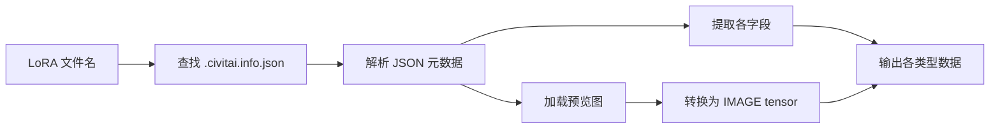

## 产品概述

创建一个新的 ComfyUI 自定义节点 `CivitaiInfoReader`，用于读取 LoRA 模型对应的 `.civitai.info.json` 元数据文件，并将其中的各项信息分别输出，方便在工作流中使用。

## 核心功能

- **LoRA 文件选择**: 通过下拉菜单选择 LoRA 文件，自动查找对应的 `.civitai.info.json` 文件
- **图片输出**: 读取本地预览图，转换为 ComfyUI IMAGE tensor 格式输出
- **元数据输出**: 分别输出模型名称、触发词、模型介绍、基础模型、版本名称、模型类型、评分、下载量、NSFW 级别等信息
- **原始 JSON 输出**: 输出完整的原始 JSON 字符串，供其他节点使用

## 技术栈

- **语言**: Python 3.x
- **框架**: ComfyUI 节点开发框架
- **依赖库**: 
- `torch` (tensor 处理)
- `PIL/Pillow` (图片加载)
- `numpy` (数组转换)
- `json` (JSON 解析)
- `folder_paths` (ComfyUI 路径工具)

## 技术架构

### 系统架构

节点采用单文件独立实现，复用现有 `civitai_utils.py` 的工具函数，遵循项目现有的节点开发模式。

### 数据流



### 实现方案

1. **文件查找**: 使用 `folder_paths.get_full_path("loras", lora_name)` 获取 LoRA 路径，替换扩展名为 `.civitai.info.json`
2. **元数据加载**: 使用 `civitai_utils.load_cached_metadata()` 读取 JSON
3. **图片加载**: 使用 PIL 打开图片，转换为 numpy 数组，再转为 torch tensor (BHWC, float32, 0-1)
4. **输出定义**: 使用多种 RETURN_TYPES（IMAGE、STRING、INT、FLOAT、BOOLEAN）

### 性能考虑

- 图片加载后缓存在内存中，避免重复读取
- JSON 解析使用标准库，性能开销可忽略
- 图片转换使用 numpy 向量化操作，效率高

## 实现细节

### 关键代码结构

```python
class CivitaiInfoReader:
    @classmethod
    def INPUT_TYPES(cls):
        # 从 folder_paths 获取 LoRA 文件列表
        loras = folder_paths.get_filename_list("loras")
        return {
            "required": {
                "lora_name": (loras, {"tooltip": "选择 LoRA 文件"}),
            }
        }
    
    RETURN_TYPES = ("IMAGE", "STRING", "STRING", "STRING", "STRING", ...)
    RETURN_NAMES = ("image", "model_name", "trigger_words", "description", ...)
    FUNCTION = "read_info"
    CATEGORY = "naiba-node"
```

### 图片转换逻辑

```python
from PIL import Image
import numpy as np
import torch

def load_image_as_tensor(image_path):
    img = Image.open(image_path).convert("RGB")
    img_array = np.array(img).astype(np.float32) / 255.0
    tensor = torch.from_numpy(img_array)[None,]  # 添加 batch 维度 -> (1, H, W, C)
    return tensor
```

### 路径安全

- 使用 `os.path.exists()` 验证文件存在
- 使用 `os.path.realpath()` 防止路径遍历